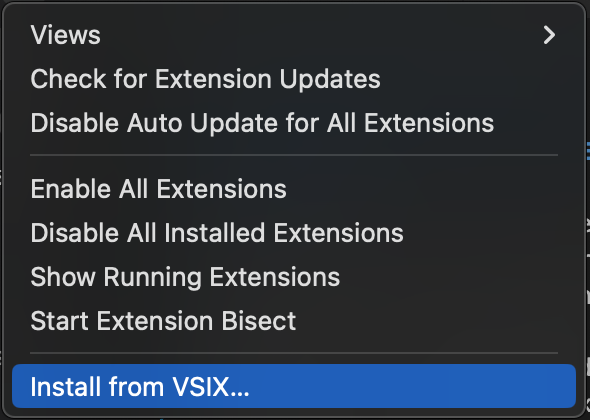
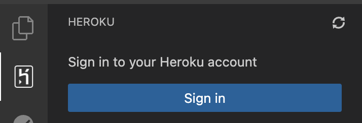
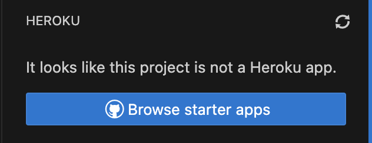
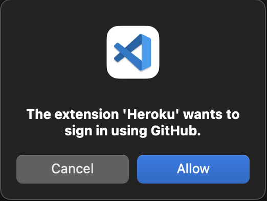
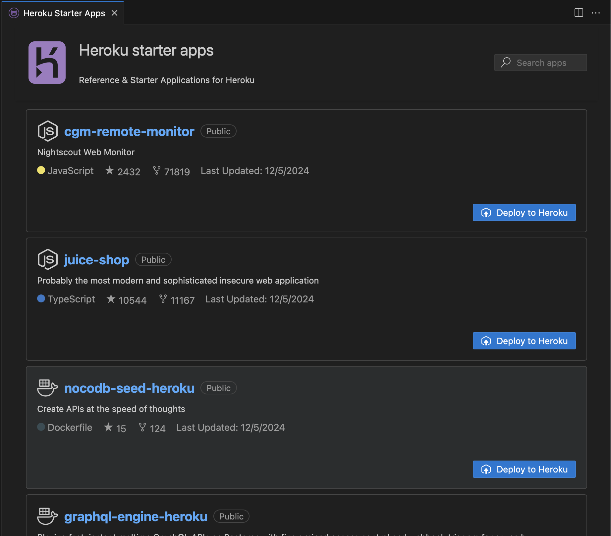
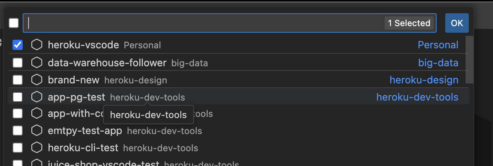
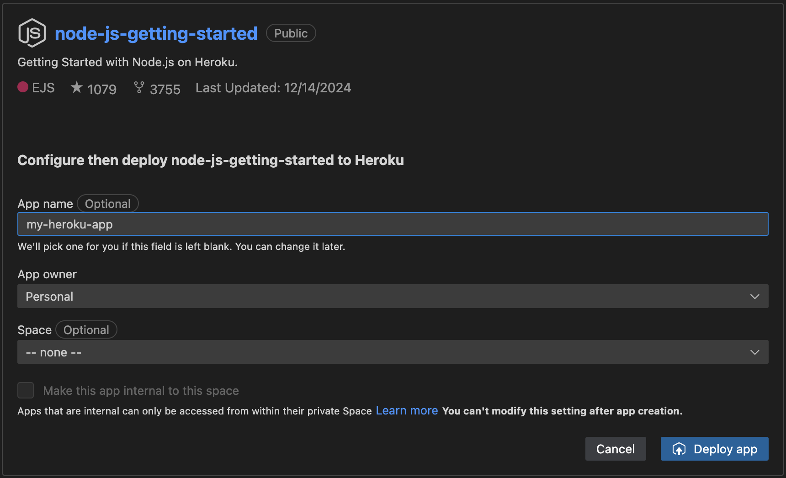
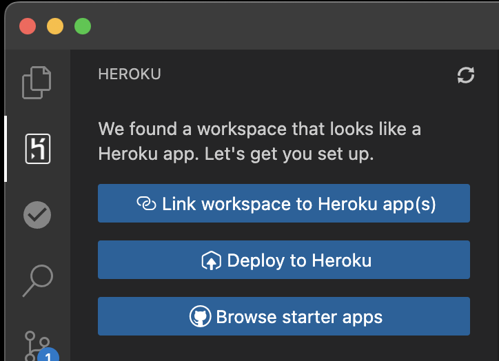

# Heroku VSCode Extension

[!NOTE] This repository is archived. Refer to [heroku-vscode](https://github.com/heroku/heroku-vscode) for updates to the Heroku VSCode extension.

## Introducing the Heroku Extension for Visual Studio Code: Simplifying Cloud Development
We’re thrilled to introduce the **Heroku Extension for Visual Studio Code**, designed to streamline your workflow and bring Heroku’s power directly into your development environment. Developing on Heroku has always been about simplicity and efficiency.

Whether you're a seasoned developer managing cloud applications or just starting on Heroku, this extension is built to reduce context-switching and keep you focused on writing great code.

## Why the Heroku Extension?
Cloud development often requires toggling between multiple tools—CLI commands, the Heroku dashboard, and external resources. The Heroku Extension for VS Code eliminates this hassle by integrating Heroku’s core functionality into the IDE you already love. Here’s what makes it a game-changer:
1. **Seamless Support**: The extension is fully compatible with Visual Studio Code, Salesforce Code Builder, and VS Code forks like Cursor.
1. **Efficient Resource Management**: Manage dynos, add-ons, and other resources directly within your editor.
1. **Heroku CLI Integration**: Access CLI functionality through the extension for a smoother, more intuitive experience.
1. **Easy Deployments**: Deploy your app to heroku without ever leaving VS Code.

## Installation
The instructions for installing the Heroku VSCode extension is roughly the same for locally installed and container-based VSCode instances. Any differences in installation instructions will be enumerated specifically.
1. Ensure that you have the latest [Heroku CLI](https://devcenter.heroku.com/articles/heroku-cli) installed on the machine running VSCode.
    1. Container based VSCode users including [Code Builder](https://www.salesforce.com/platform/code-builder/) users will need to install the Heroku CLI using NPM in a terminal. `npm i -g heroku@9.5.0`
    2. If older versions of the CLI are required due to compatibility issues with plugins required by your organization, some features in the extension may not behave as expected.
1. Download the .vsix file from the [releases](https://github.com/heroku/heroku-vscode-releases/releases) section of this repository.
1. Open the extensions panel in your VSCode instance and choose "install from VSIX..." from the actions menu `...` at the top-right of the leftmost panel

1. Browse for the location of the downloaded vsix and select it.
1. You should see a notification that the installation has completed successfully and the Heroku icon will be visible in the leftmost Activity Bar of your VSCode instance.

## Usage
### Authentication
If you have previously authenticated to Heroku and can use the CLI without it prompting you to login, you can skip these steps.
1. Select the Heroku icon in the Activity bar and click "Sign in"

 

or open a terminal and run `heroku login`. Note that some Mac users may see an [IP address mismatch](https://stackoverflow.com/questions/63363085/ip-address-mismatch-on-signing-into-heroku-cli) when using the terminal to authenticate and must use interactive mode for authentication instead. `heroku login -i`
1. Follow the instructions to authenticate to your Heroku account.
1. If you have trouble authenticating please log an issue with the error given and repo steps.

## Quick setup for your Heroku Extension
There are 3 paths to take when setting up your extension:
1. **Quick start from scratch** - You do not yet have a Heroku app setup and want to start with a template.
1. **Quick start with a locally cloned repo** - You already have a locally cloned repo with an app.json in the root and wants to quickly configure and deploy to Heroku
1. **Quick start by linking an existing app** - The user has a locally cloned repo which has previously been deployed to Heroku and wants to link 1 or more Heroku app(s) with the local repo

### Quick start from scratch
1. Open the Heroku extension by selecting the icon in the activity pane
1. You should see the "Browse starter apps":

1. Click "Browse starter apps". You may be asked to authenticate with Github. Click allow and complete the auth process.

1. Browse reference repositories and choose one to deploy

1. Follow instructions to clone locally and wait for deployment to complete.

### Quick start with a locally cloned repo
1. Open the workspace of the locally cloned repo that you'd like to deploy to Heroku.
1. Choose "Deploy to Heroku"

1. Configure your app and choose "Deploy app"

### Quick start by linking an existing app
1. Open the workspace of the locally cloned repo that you'd like to link to Heroku.
1. Choose "Link workspace to Heroku app(s)"

1. Select 1 or more app from the quick pick and click ok

